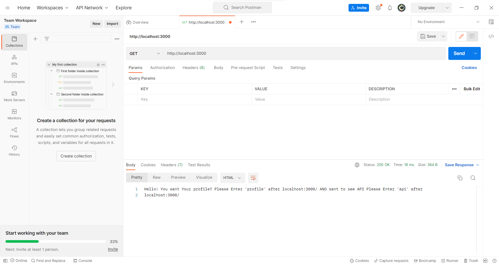
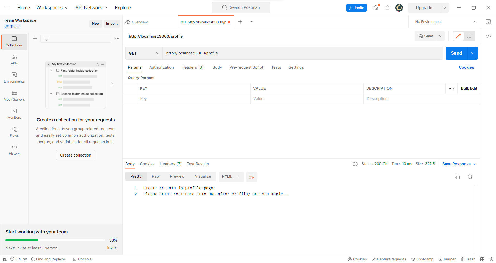
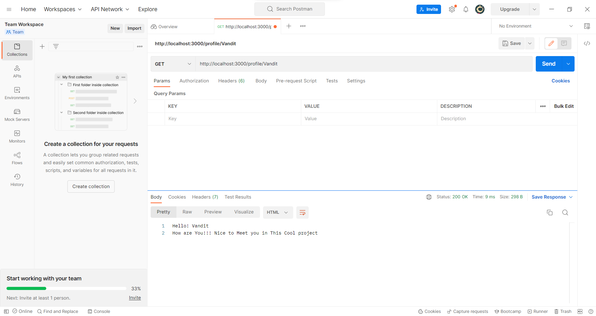
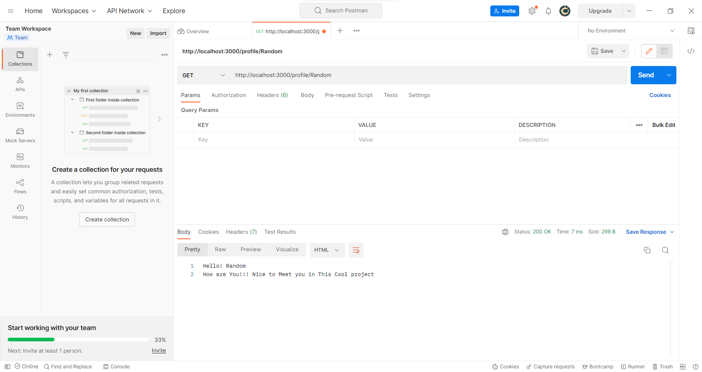
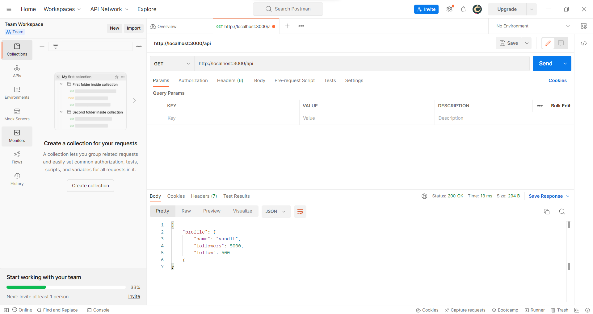
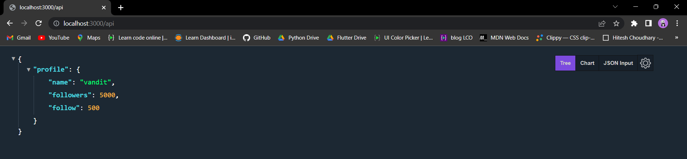
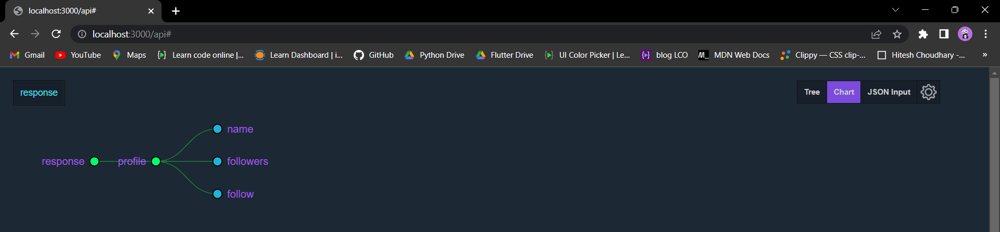

<!-- Intro -->
# All About Back-End

<!-- Social Links -->
[![LinkedIn][linkedin-shield]][linkedin-url]
[![Instagram][instagram-shield]][instagram-url]
[![Twitter][twitter-shield]][twitter-url]
[![Hashnode][hashnode-shield]][hashnode-url]

<!-- PROJECT LOGO -->
 

  

<h3 align="center">Basic Flow of ExpressJS</h3>

  

<!-- ABOUT THE PROJECT -->

 

## About The Project

In this Project I've built local server project and Now I'm help you to Start this simple project in Your system.
 

### Step 1: First Download this project.
### Step 2: Open Terminal and write 'npm start' command to run the entire project.
### Step 3: Go to the browser and run 'localhost:3000' and see the same output as below

### Step 4: Now you write '/profile' after the 'localhost:3000' and go to profile page and see the same output as below

### Step 5: Now you write your name after the 'localhost:3000/profile' like 'localhost:3000/profile/Vandit' and see your given name is display on screen and see the same output as below

### Step 5: Now you write '/api' after the 'localhost:3000' and see the API of pass local data and same output as below

### Step 6: Now you can write your API and built a small project like this and any question for me then ping me!

 

## Built With

**Using Technologies**

1. NodeJS
2. ExpressJS
3. nodemon
4. Postman

 

## Learnt
In This project I learnt about ExpressJS and nodemon.
- ExpressJS
- nodemon

 

## Time

For this project I took around `10 to 15 minutes` to complete it.

 

# 🔰 Installation
### Step 1: Open the path of file direction in your terminal.
### Step 2: Run 'npm init -y' command in terminal. '-y' for all permission is accepted.
### Step 3: Run 'npm install -g express' command in terminal to install express in the project.
### Step 4: Run 'npm install nodemon' command in terminal for automatic refresher in the browser.
 

<!-- CONTACT -->

# ➿ For any query? ping me!

- **Name 👨‍💻:** [Vandit Bera](https://github.com/vandit-bera)
- **Email 📧:** [vanditbera@gmail.com](mailto:vanditbera@gmail.com)
- **Blog 📝:** [blogs.Vandit2510.in](https://vandit-bera.hashnode.dev/)

Project Link: [GitHub](https://github.com/vandit-bera/Basic-Flow-of-ExpressJS)

<!-- Linkedin -->

[linkedin-shield]: https://img.shields.io/badge/-LinkedIn-black.svg?style=for-the-badge&logo=linkedin&colorB=0B5FBB
[linkedin-url]: https://www.linkedin.com/in/vandit-bera-4a0b02221/

<!-- Instagram -->

[instagram-shield]: https://img.shields.io/badge/Instagram-%23E4405F.svg?style=for-the-badge&logo=Instagram&logoColor=white
[instagram-url]: https://instagram.com/vandit.bera

<!-- Twitter -->

[twitter-shield]: https://img.shields.io/badge/Twitter-%231DA1F2.svg?style=for-the-badge&logo=Twitter&logoColor=white
[twitter-url]: https://twitter.com/vandit_bera_

<!-- Hashnode -->

[hashnode-shield]: https://img.shields.io/badge/Hashnode-2962FF?style=for-the-badge&logo=hashnode&logoColor=white
[hashnode-url]: https://vandit-bera.hashnode.dev/

